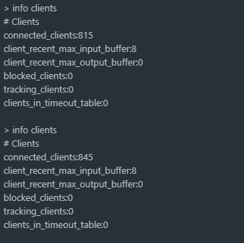

# [关于客户端集成sentinel-datasource-redis连接数不能释放问题](https://github.com/alibaba/Sentinel/issues/2075)


> ### 本项目demo用于演示重现bug。


- spring-cloud-alibaba版本：2.2.5.RELEASE

- sentinel-dashboard版本：1.8.0

- sentinel-datasource-redis版本：1.8.0


## bug出现场景


- 客户端在引用`spring-cloud-starter-alibaba-sentinel`和`sentinel-datasource-redis`包，配置`spring.cloud.sentinel.datasource`属性

  ```yaml
  spring:
    application:
      name: product
    cloud:
      sentinel:
        eager: true
        enabled: true
        transport:
          dashboard: 127.0.0.1:8080 # Sentinel 控制台地址
        filter:
          url-patterns: /** # 拦截请求的地址。默认为 /*
        datasource:
          flow:
            redis:
              rule-type: FLOW
              host: 127.0.0.1
              port: 6379
              database: 0
              rule-key: sentinel:rules:flow:${spring.application.name}
              channel: sentinel:rules:flow:channel:${spring.application.name}
              master-id: sentinel:rules:flow:master-id:${spring.application.name}
  ```


- 引入`spring-boot-starter-actuator` 并配置`endpoints`属性，如

```yaml
management:
  endpoints:
    web:
      exposure:
        include: '*'
  endpoint:
    health:
      show-details: always
```

- 接入spring-boot-admin系统

- `spring-cloud-starter-alibaba-sentinel`包中`SentinelEndpointAutoConfiguration`配置类生效

  每次获取端点信息时，`SentinelHealthIndicator`会去读取Redis中的规则数据，在获取完数据之后 Redis的连接数不能正常关闭，**并且随着时间增加连接数，最终全部占满连接数 导致Redis服务不可用**。




## 本demo项目使用

1、启动eureka

2、启动sentinel-dashboard，sentinel-dashboard中有使用Redis进行改造，默认redis配置为127.0.0.1:6379，按照本地自己的Redis进行配置即可。

3、启动spring-boot-admin

4、启动order-demo、product-demo

5、进入Redis服务端使用`info clients`命令观察连接数。
